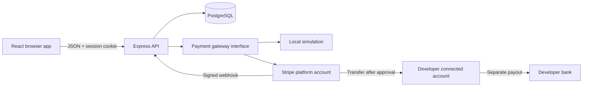

# Architecture and decisions

## System boundaries

React handles presentation. Express owns authorization, price calculations, status transitions and provider calls. PostgreSQL is authoritative for application state. Stripe is authoritative for external payment outcomes. A browser redirect is navigation, not proof of payment.

The monorepo keeps independently runnable frontend/backend apps alongside shared database/contracts packages. Feature modules group business behavior. The payment gateway has no database dependency; the order service decides whether a transfer is authorized and the adapter translates it into provider API calls.

## Roles and ownership

CLIENT buys services. DEVELOPER sells and may also buy another developer's services. ADMIN is assigned by the local seed, never a registration request. Role checks alone are insufficient: reading an order additionally requires being that order's buyer/seller or an admin. Publishing requires being the listing owner, verified, and ready to receive transfers.

## Persistence

Users retain password hashes and onboarding IDs/status, sessions retain hashed random session credentials with expiration, and auth tokens retain hashed single-use verification/reset credentials. Services store current catalog data. Orders snapshot title, buyer/seller, price, commission, seller share and currency so editing a listing cannot change an existing purchase. Order events form a customer-visible audit timeline. Webhook event IDs provide durable deduplication. Financial operation state records which provider action is in progress and its stable identity.

Keep money in integer cents. For `totalCents = 10000`, `feeCents = Math.floor(totalCents * 0.10)` and `sellerCents = totalCents - feeCents`. Never use browser-supplied fee or payout values. Reporting distinguishes gross volume, retained commission and seller transfers; none is a claim of net profit or settled bank balance.

## Three state machines

Order lifecycle: AWAITING_PAYMENT -> PAID -> IN_PROGRESS -> DELIVERED -> COMPLETED. Revision returns DELIVERED to IN_PROGRESS. Cancellation/refund has explicit allowed entry states.

Payment lifecycle: UNPAID/PENDING -> PAID or FAILED; successful payment can later become REFUND_PENDING, REFUNDED or DISPUTED.

Transfer lifecycle: NOT_RELEASED -> PENDING -> TRANSFERRED or FAILED.

An approved order can be completed while its transfer awaits recovery. The UI must show both states so approval is never confused with receipt in a bank account. A dispute freezes release. A stale payment-success event must not undo a refund/dispute.

## Retryable financial execution

A database transaction cannot atomically commit a Stripe API request. Persist intent, use a conditional update or database lock to reserve the operation, call Stripe with a stable idempotency key, and persist the result. Repeated requests reuse the same logical operation. Webhook handlers also deduplicate inside transactions, not with a read-then-write race.

Stable provider keys are `account:{userId}`, `checkout:{orderId}:{attempt}`, `transfer:{orderId}` and `refund:{orderId}`. A transfer is linked to the successful platform charge via `source_transaction`. This is separate charges and transfers; destination charges would be a different design.

Provider timeouts are ambiguous, not proof of failure. Persist references and reconcile the Stripe dashboard/API before forcing an operation to retry outside the provider's idempotency retention period. A deployed service needs durable background reconciliation and operational alerting.

## Environment and email

`PAYMENT_MODE=demo` supports a complete local flow without network payment calls. `PAYMENT_MODE=stripe` requires sandbox credentials and verified Stripe webhook events. Orders record their mode to prevent switching configuration from paying a simulated order with provider calls. Demo is rejected in production, and live Stripe keys are excluded from this exercise.

Local email is a development mailbox containing verification/reset links. It must be disabled outside local development. Delivering production email requires a real SMTP/email adapter, delivery observability and verified sender configuration. The repository's local mailbox is a deliberate teaching tool.

## Decisions and scope

- One order, one seller, one currency: focuses the exercise on Connect instead of cart allocation or FX.
- Text/HTTPS delivery links: avoids file storage and malware handling in this exercise.
- Full refund before transfer only: post-transfer refunds require coordinated transfer reversal and are an explicit manual-support path.
- Stripe-hosted checkout/onboarding: payment details and identity documents stay on Stripe-hosted forms.
- No automatic release deadline: buyer approval is the learning trigger. A commercial service needs explicit terms, timeout and dispute policies.
- PostgreSQL is used in development and integration tests; no in-memory persistence substitute for the application.
